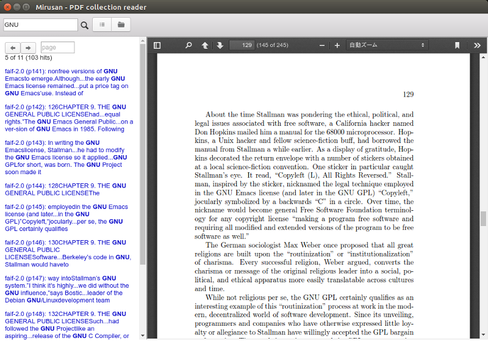

# Mirusan
[](https://ci.appveyor.com/project/mknz/mirusan/branch/master)




A PDF collection reader with built-in full text search engine

Written in Python / Electron / Elm / Javascript

## Features

- Quick incremental search

- Simple UI

- Local database (You have controll 100% of your data)

- Easy installation (No need to install external databases)

- Multiplatform (Linux, Mac, Windows)

## Language support

Mirusan automatically detects input language using [Google's language-detection](https://pypi.python.org/pypi/langdetect). Tokenizer or analyzer for indexing is chosen according to the detected language.

For following languages, Whoosh's built-in [LanguageAnalayzer](http://whoosh.readthedocs.io/en/latest/api/analysis.html#whoosh.analysis.LanguageAnalyzer) or [StandardAnalyzer](http://whoosh.readthedocs.io/en/latest/api/analysis.html#whoosh.analysis.StandardAnalyzer) (for English) is used.

(though currently it does not work properly for Arabic.)

```
Arabic
Danish
Dutch
English
Finnish
French
German
Hungarian
Italian
Norwegian
Portuguese
Romanian
Russian
Spanish
Swedish
Turkish
```

For other languages, [N-gram tokenizer](http://whoosh.readthedocs.io/en/latest/api/analysis.html#whoosh.analysis.NgramTokenizer) (minsize=1, maxsize=2) is used.

## Quickstart

```sh
#install python3
#install node.js

git clone https://github.com/mknz/mirusan.git

cd ./mirusan
cd ./search
pip install -r requirements.txt

cd ../electron
npm install
npm run compile

npm start
```

## License

[GPLv3](https://www.gnu.org/licenses/gpl-3.0.en.html)

## Acknowledgements
[Whoosh (Pure Python search engine library)](http://whoosh.readthedocs.io/en/latest/)

[pdf.js](https://github.com/mozilla/pdf.js)

[Electron](http://electron.atom.io/)

[Photon](http://photonkit.com/)

[Elm](http://elm-lang.org/)

[elm-electron](https://github.com/elm-electron/electron/tree/master/examples/ipcRenderer)
